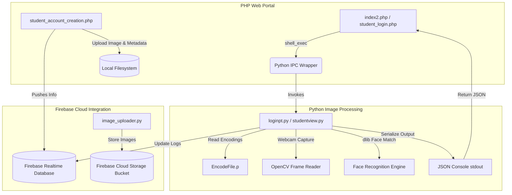

# Legacy Face Recognition Attendance System

A legacy face-recognition-based attendance system built with OpenCV, `face_recognition`, and Firebase. This system features a PHP web frontend coupled with a Python desktop backend for real-time face detection, user registration, and database management.

> ℹ️ **Status:** This is the legacy/archived desktop-focused repository. For the modernized, production-ready, and containerized web application, see the [FaceAttend Rewrite](https://github.com/Arjob-Das/Face-recognition-web-app-login-attendance-).

---

## 📋 Table of Contents

1. [Detailed Explanation](#-detailed-explanation)
2. [Architecture](#-architecture)
3. [Features](#-features)
4. [Project Structure](#-project-structure)
5. [Prerequisites](#-prerequisites)
6. [Setup of OS](#-setup-of-os)
   - [Windows Setup](#windows-setup)
   - [Linux (Ubuntu/Debian) Setup](#linux-ubuntudebian-setup)
7. [Building and Initializing the App](#-building-and-initializing-the-app)
8. [Using the App](#-using-the-app)
   - [Desktop Camera Loop](#desktop-camera-loop)
   - [Webpage Portal Mode](#webpage-portal-mode)
9. [License](#-license)

---

## 📖 Detailed Explanation

This repository provides a hybrid system connecting a PHP-based web administration portal with Python-based real-time image processing and face recognition. 

### How It Works:
1. **Web Registration:** Students and teachers register via PHP pages. Image uploads are processed locally, and user metadata is pushed to Firebase Realtime Database.
2. **Face Encoding:** The local images are processed by a Python backend that extracts 128-dimensional vector facial embeddings using the `dlib` ResNet-34 face recognition model, saving the serialized encodings file.
3. **Face Verification / Attendance:** 
   - **Desktop Mode:** Runs a loop scanning frames from the system webcam, matching face vectors against the encoded database in real-time. Attendance checks are recorded in Firebase with timestamp limits.
   - **Web Mode:** PHP pages trigger lightweight, single-execution Python scripts (`loginpt.py`, `logintch.py`, `studentview.py`) via shell execution. These Python scripts capture a frameset from the webcam, run face recognition, and return results to PHP as structured JSON payloads for web-view rendering.

---

## 🏗️ Architecture

The system coordinates between the frontend PHP layer, local system hardware (webcam), python processing modules, and Firebase cloud services.



---

## 🌟 Features

- **Real-Time Recognition:** Desktop-based webcam feed recognition with face bounding boxes and status overlays.
- **Bi-Role Capabilities:** Separate support for Student and Teacher registration, login, and attendance tracking.
- **Smart Cooldown:** Integrated attendance check timeout (30 seconds for desktop / 5 minutes for webpage) to prevent duplicate log entries.
- **Centralized Firebase Integration:** Centralized configuration that supports dynamically routing connections to separate Student and Teacher databases.
- **Webpage Portal:** PHP-based user forms for student/teacher registration, login, and info viewing, invoking the Python scripts under the hood.

---

## 📂 Project Structure

```
legacy-attendance-app/
├── firebase_config.py          # Centralized Firebase initialization (multi-app support)
├── test.py                     # Main student attendance camera loop
├── loginpt.py                  # Student face-identification script
├── encodegenerator.py          # Script to generate student face encodings
├── add_data_db.py              # CLI tool to add student profiles to Firebase
├── serviceAccountKey.json.template   # Template for student Firebase service account
├── serviceAccountKey2.json.template  # Template for teacher Firebase service account
├── requirements.txt            # Python dependencies
├── attendance.php              # PHP script triggering student attendance loop
├── index1.php                  # PHP student registration portal
├── index2.php                  # PHP student verification display
├── style.css / style1.css      # Front-end stylesheets
├── Resources/                  # Desktop GUI assets (background, modes)
│   ├── background.png
│   └── Modes/
├── Images/                     # Local student face image directories
└── webpage/                    # Extended PHP web application portal
    ├── student_account_creation.php  # Student portal registration
    ├── teacher_account_creation.php  # Teacher portal registration
    ├── student_login.php             # Student face-recognition login form
    ├── teacher_login.php             # Teacher face-recognition login form
    ├── studentview.py                # Python backend to view student profile
    ├── adddata.py                    # Python backend to save student to database
    ├── adddatateacher.py             # Python backend to save teacher to database
    ├── image_uploader.py             # Python backend to upload/encode student images
    ├── image_uploader_T.py           # Python backend to upload/encode teacher images
    ├── loginpt.py                    # Python backend for student face login
    ├── logintch.py                   # Python backend for teacher face login
    ├── stud_face.py                  # Python backend for student attendance
    └── teach_face.py                 # Python backend for teacher attendance
```

---

## 🛠️ Prerequisites

- **Hardware:** Connected webcam for face capture
- **Firebase:** Two separate Firebase projects (one for Students, one for Teachers) with Realtime Database and Cloud Storage enabled.
- **Python:** 3.8+ (with `pip` and environment setup)
- **Web Server:** A web server running PHP (e.g., Apache, Nginx, or local packages like XAMPP)

---

## 💻 Setup of OS

Follow the appropriate instructions depending on your operating system.

### Windows Setup

1. **Install Python:**
   - Download Python 3.8+ installer from python.org.
   - **Important:** Ensure the "Add Python to PATH" checkbox is ticked during installation.

2. **Install C++ Compiler (Required for `dlib`):**
   - Install **Visual Studio Build Tools** (e.g., 2019 or 2022).
   - In the Visual Studio Installer, select the **Desktop development with C++** workload. This is required to compile `dlib` and `face-recognition` libraries.

3. **Install CMake:**
   - Install CMake via `pip install cmake` or download it from the official website.

4. **Install PHP Web Server:**
   - Download and install **XAMPP** (includes Apache and PHP).
   - Move or clone this project repository into `C:\xampp\htdocs\`.
   - Ensure the Apache service is started from the XAMPP Control Panel.

---

### Linux (Ubuntu/Debian) Setup

1. **Update Package Repositories:**
   ```bash
   sudo apt update
   ```

2. **Install System Dependencies (For OpenCV, CMake, and C++ Libraries):**
   ```bash
   sudo apt install -y build-essential cmake pkg-config \
   libx11-dev libatlas-base-dev libgtk-3-dev libboost-python-dev \
   python3-pip python3-dev python3-venv
   ```

3. **Install Web Server and PHP:**
   ```bash
   sudo apt install -y apache2 php libapache2-mod-php
   ```
   - Ensure Apache is running:
     ```bash
     sudo systemctl enable apache2
     sudo systemctl start apache2
     ```

4. **Deploy Application to Web Server Root:**
   - Move or clone this repository into `/var/www/html/`:
     ```bash
     sudo git clone https://github.com/Arjob-Das/Legacy-Face-Attendance-Recognition-based-Attendance-System.git /var/www/html/legacy-attendance-app
     ```
   - Grant proper permissions so PHP scripts can save images and run subprocesses:
     ```bash
     sudo chown -R www-data:www-data /var/www/html/legacy-attendance-app
     sudo chmod -R 755 /var/www/html/legacy-attendance-app
     ```

---

## 🛠️ Building and Initializing the App

1. **Setup Python Virtual Environment:**
   Navigate to the project root inside `legacy-attendance-app` and create a virtual environment:
   - **Windows:**
     ```bash
     python -m venv venv
     venv\Scripts\activate
     ```
   - **Linux:**
     ```bash
     python3 -m venv venv
     source venv/bin/activate
     ```

2. **Install Python Libraries:**
   ```bash
   pip install -r requirements.txt
   ```

3. **Configure Firebase Projects:**
   - Set up two Firebase projects: one for Students and one for Teachers.
   - Enable **Realtime Database** and **Cloud Storage** for both.
   - Download the Service Account private key JSON files from the Firebase Console (under Project Settings -> Service Accounts).
   - Copy `serviceAccountKey.json.template` to `serviceAccountKey.json` and paste your Student Firebase credentials.
   - Copy `serviceAccountKey2.json.template` to `serviceAccountKey2.json` and paste your Teacher Firebase credentials.
   - Edit `firebase_config.py` and populate the configuration constants:
     ```python
     STUDENT_DATABASE_URL = "https://your-student-db-default-rtdb.firebaseio.com/"
     STUDENT_STORAGE_BUCKET = "your-student-db.appspot.com"
     TEACHER_DATABASE_URL = "https://your-teacher-db-default-rtdb.firebaseio.com/"
     TEACHER_STORAGE_BUCKET = "your-teacher-db.appspot.com"
     ```

---

## 🚀 Using the App

### Desktop Camera Loop

1. **Load Initial Student Records:**
   Insert student dummy data to your Firebase database using:
   ```bash
   python add_data_db.py
   ```
2. **Collect Student Face Images:**
   Add student face images to the `Images/` folder, naming each file exactly with the student's ID (e.g., `123456.jpg`).
3. **Compile Face Encodings File:**
   ```bash
   python encodegenerator.py
   ```
   *This compiles the face vectors and serializes them into `EncodeFile.p`.*
4. **Run Real-Time Attendance GUI:**
   ```bash
   python test.py
   ```
   *A window will display showing your webcam. Looking at the camera will identify you, display your info, and automatically update your attendance count in Firebase.*

---

### Webpage Portal Mode

1. **Access the Registration Portal:**
   Open the registration forms in your browser:
   - **Localhost Link:** `http://localhost/legacy-attendance-app/webpage/student_account_creation.php`
   - Fill in the form fields, upload your portrait photo, and click register. This triggers `adddata.py` to write your record to Firebase and `image_uploader.py` to compile the encodings.

2. **Perform Face Login:**
   - Go to `http://localhost/legacy-attendance-app/webpage/student_login.php`.
   - The web app runs `loginpt.py` locally which checks your webcam.
   - Once recognized, it retrieves your data from Firebase and redirects you to the student viewer showcasing your personal information.

---

## 📄 License

This project is licensed under the [MIT License](LICENSE).
